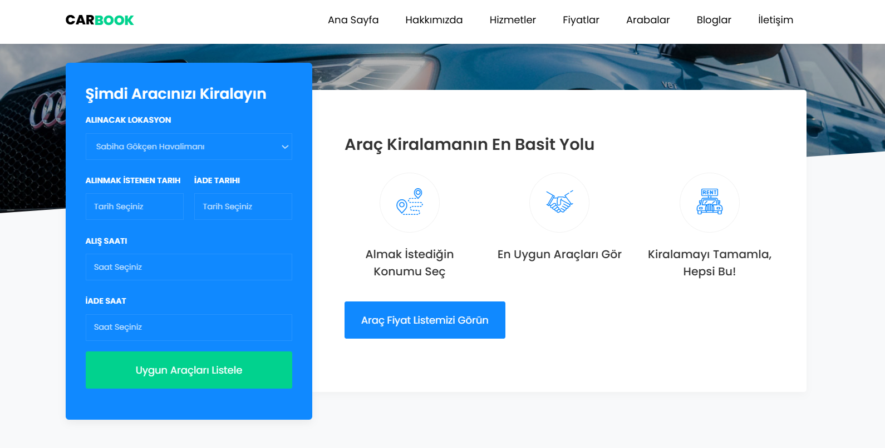
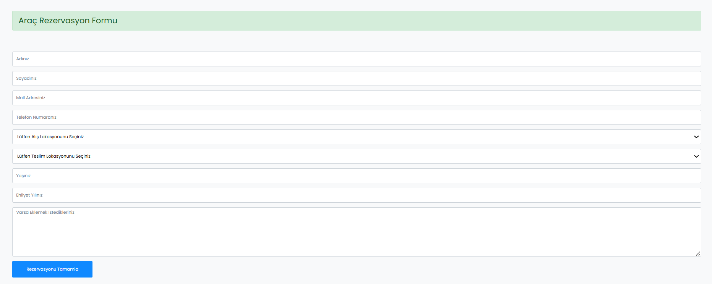
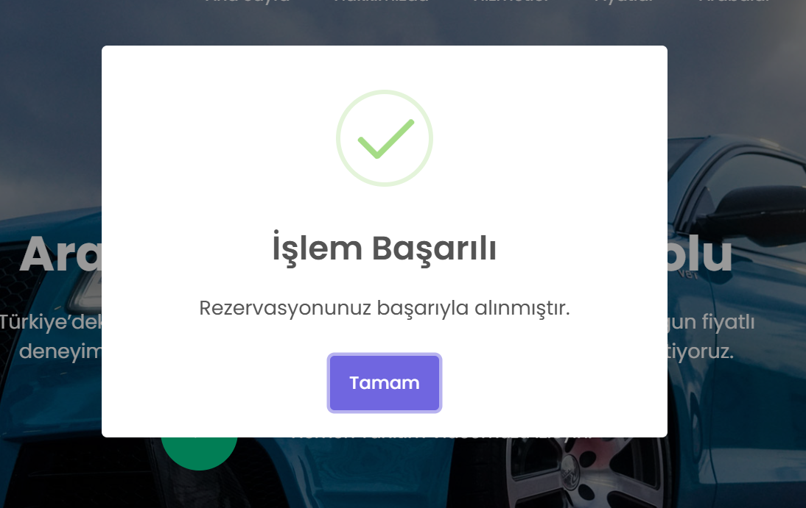
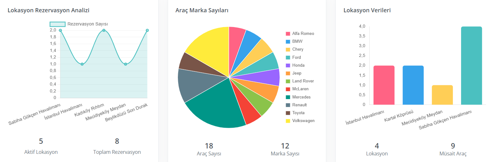

# 🚗 CarBook Projesi

Bu proje, modern yazılım mimarileri ve tasarım desenleri kullanılarak geliştirilmiş, ölçeklenebilir ve kurumsal mimariye uygun bir araç kiralama sistemidir.

### 📸 Proje Ekran Görüntüleri

| Ana Sayfa | Rezervasyon Arama | Rezervasyon Formu |
| :---: | :---: | :---: |
|  |  |  |

| İşlem Başarılı | Dashboard & Analiz | Araç Detay Sayfası |
| :---: | :---: | :---: |
|  |  |  |

---

### 🏗️ Kullanılan Teknolojiler & Mimari
* **Onion Architecture:** Proje; Core, Application, Persistence ve Infrastructure olmak üzere 4 ana katmandan oluşur.
* **CQRS Design Pattern:** Veri yazma (Command) ve veri okuma (Query) sorumlulukları birbirinden ayrılmıştır.
* **MediatR:** Katmanlar arası iletişimi merkezi bir yapı üzerinden sağlayarak bağımlılıkları (coupling) minimize eder.
* **ASP.NET Core 8.0:** Modern Web API ve WebUI entegrasyonu.
* **Entity Framework Core:** Veritabanı yönetim ve sorgulama işlemleri için ORM kullanımı.

---

### 🛠️ Tamamlanan Özellikler (Milestones)

#### 1. Gelişmiş Araç Detay Modülü (Yeni)
* **Dinamik İçerik Yönetimi:** Araç açıklamaları ve donanım özellikleri (Features) Mediator deseniyle asenkron olarak listelendi.
* **Smart Tab System:** Bootstrap tab yapısı kullanılarak Özellikler, Açıklama ve Yorumlar bölümleri tek sayfada akıcı bir şekilde yönetildi.
* **Dinamik Puanlama:** Araçlara verilen yıldızlı puanlar (1-5 arası) ve bu puanların yüzde oranları dinamik olarak hesaplanıp görselleştirildi.

#### 2. Akıllı Yorum & Avatar Sistemi
* **Hybrid Avatar Logic:** Profil fotoğrafı olan kullanıcıların resmi, olmayanların ise ad-soyad baş harflerinden oluşan (Örn: "AY") özel tasarım avatarları otomatik olarak oluşturuldu.
* **Letter Extraction Algorithm:** C# tarafında geliştirilen mantık ile kullanıcı adının tek veya çift kelime olmasına göre (ilk 2 harf veya baş harfler) karakter ayıklama işlemi sağlandı.

#### 3. Blog & Yorum Sistemi
* **Dinamik Blog Yönetimi:** Blog içerikleri ve detay sayfaları API üzerinden dinamik olarak yönetiliyor.
* **Tarih Formatlama:** Yorum ve blog tarihleri kullanıcı dostu (dd MMMM yyyy HH:mm) formatına getirildi.

#### 4. Kullanıcı Deneyimi (UI/UX)
* **SweetAlert2 Entegrasyonu:** Modern, şık ve interaktif modal pencereler sisteme dahil edildi.
* **Dinamik Rezervasyon:** Kullanıcı dostu arayüz üzerinden lokasyon ve tarih bazlı araç arama ve rezervasyon akışı sağlandı.

#### 5. Veri Görselleştirme & Dashboard
* **Dynamic Chart.js Integration:** Dashboard paneli üzerinde verilerin anlık takibi için interaktif grafikler entegre edildi.
* **İstatistiksel Analiz:** Marka dağılımı (Pie), Lokasyon kapasitesi (Bar) ve Rezervasyon trendleri (Line) görselleştirildi.

---

### ⚙️ Teknik Detaylar (İç Mimari)
* **Statistics Repository:** Verilerin analizi için `GroupBy` ve `Count` gibi LINQ sorgularını içeren özelleştirilmiş repository yapısı.
* **Clean DTO Mapping:** API verileri, UI katmanında Chart.js'in beklediği formatlara DTO'lar aracılığıyla dönüştürüldü.
* **Asenkron Veri Akışı:** Tüm bileşenler (ViewComponents) API verilerini asenkron olarak tüketir, bu da UI performansını artırır.

---

### 🚀 Proje Kurulumu
1. Bu depoyu klonlayın: `git clone https://github.com/kullaniciadi/carbook.git`
2. `appsettings.json` dosyasındaki **Connection String** bilgisini kendi SQL Server adresinizle güncelleyin.
3. Package Manager Console üzerinden `Update-Database` komutunu çalıştırarak tabloları oluşturun.
4. Önce **Web API** projesini, ardından **WebUI** projesini çalıştırın.
